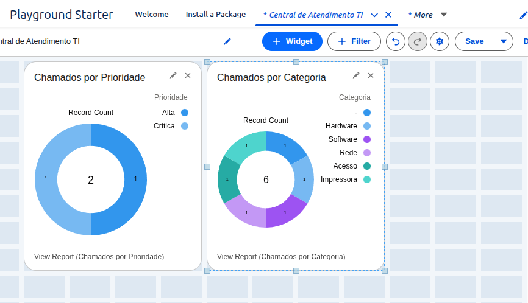
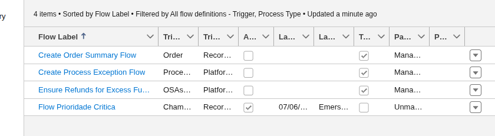
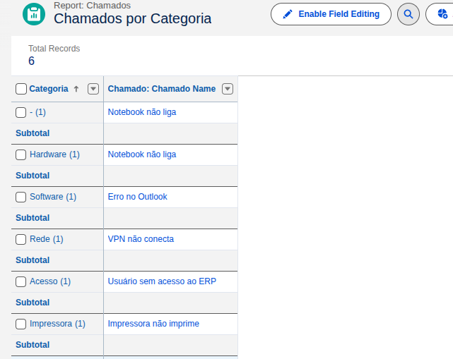

# Central de Atendimento TI - Salesforce

Projeto desenvolvido na Salesforce Platform com foco em gestão de chamados de suporte técnico.

## Funcionalidades

* Cadastro de chamados
* Controle de prioridade
* Controle de status
* Categorização de chamados
* Automação com Flow
* Regras de validação
* Relatórios analíticos
* Dashboard gerencial

## Automações

### Flow: Prioridade Crítica

Quando um chamado é criado com prioridade "Crítica", o sistema altera automaticamente o status para "Em Andamento".

## Validações

Não é permitido fechar um chamado sem preencher a descrição.

## Relatórios

* Chamados por Prioridade
* Chamados por Categoria

## Dashboard

Central de Atendimento TI

### Tecnologias

* Salesforce Platform
* Flow Builder
* Validation Rules
* Reports
* Dashboards
* Custom Objects
* Lightning Experience
## Dashboard

## Flow

## Chamado por categoria

## Usuario sem acesso

